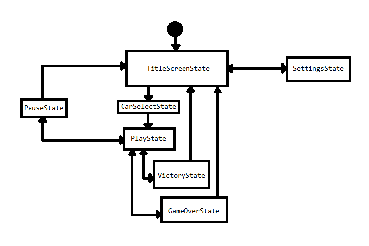
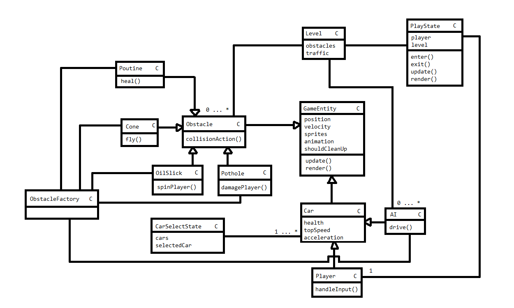
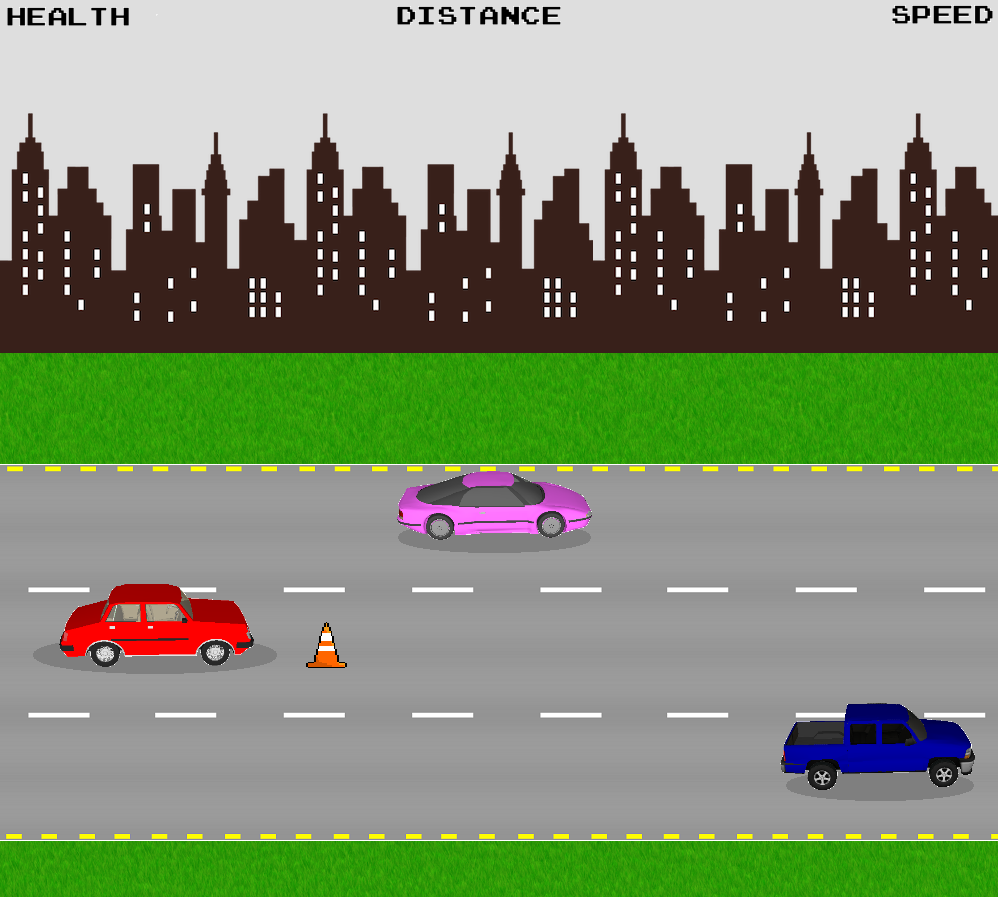

# Game Programming F21 Project - Montreal Simulator

## ✒️ Description

In this side-scroller driving game, players assume the role of a driver and navigate their car in the hazardous streets of Montreal. They will meet several obstacles along the way, which can have various effects on the player's vehicle.

## 🕹️ Gameplay

Players can accelerate, brake and switch lanes using the **ARROW KEYS**.

They can also honk their horn with the **SPACEBAR**.

The game can be paused by pressing **ENTER**.

The player has a score which is calculated based on their speed (faster = better).

To win each level, the player has to reach a specific target score.

The level system gradually increases that target as the player progresses in the game.

As they progress, the player can unlock new vehicles with better stats.

Vehicles have 3 stats: 
- Health
- Acceleration
- Top Speed

Potholes and cones will lower the vehicle's health and slow the vehicle down.

Oil slicks will spin the player out, briefly brief causing a loss of control. 

Collisions with other AI vehicles will instantly lead to a game over.

Poutines will restore vehicle health.

## 📃 Requirements

1. The user shall be able to steer the vehicle into multiple lanes.
2. The user shall be able to accelerate and brake their vehicle.
3. The user shall be able to honk their horn.
4. The user shall be able to pause the game.
5. The user shall be able to collide with AI vehicles, leading to a crash animation and game over.
6. The user shall be able to slip on oil slicks, leading to a slip animation and briefly disabling inputs.
7. The user shall be able to collide with cones, lowering health, speed, playing sound and animating cone.
8. The user shall be able to drive over potholes, lowering vehicle health, speed and playing sound.
9. The user shall be able to consume poutines to restore vehicle health.
10. The user shall be able to unlock new cars upon completing some levels.
11. The user shall be able to turn off the sound or music in the **SETTINGS** if they wish.
12. The user shall be able to reset their game / level progress in the **SETTINGS** if they wish.
13. The user shall be taken to a vehicle selection screen upon choosing **PLAY** from the title screen.

### 🤖 State Diagram

### 🗺️ Class Diagram

### 🧵 Wireframes

### 🎨 Assets

Microsoft Paint was used to create all diagrams and wireframes.

Sources are cited as necessary.

#### 🖼️ Images

- Car Spritesheet: [Source](https://www.deviantart.com/lostchild14000/art/Car-Sprite-Sheet-654708133)
- Road Texture: [Source](https://opengameart.org/content/toon-road-texture)
- Grass Texture: [Source](https://opengameart.org/content/seamless-grass-texture-ii)
- Background Texture: [Source](https://opengameart.org/content/background-night)
- Cone Sprite: [Source](https://www.pinclipart.com/pindetail/omoiRw_traffic-cone-spaceship-pixel-art-png-clipart/)
- Oil Puddle Sprite: [Source](https://thenounproject.com/term/puddle/477963/)
- Poutine Sprite: [Source](https://www.clipartmax.com/middle/m2i8i8d3Z5m2m2H7_poutine-canada-poutine-clipart/)
- Pothole Sprite: [Source](https://www.pngall.com/hole-png/download/36973)
- Lock Sprite: [Source](https://www.iconsdb.com/white-icons/padlock-6-icon.html)
- Skyline: [Source](https://www.deviantart.com/horner735/art/Repeating-skyline-for-dragon-game-background-621408304)
- Fire: [Source](http://pixelartmaker.com/art/9302e491c4282b7)

The skyline image was edited so that its background would be transparent.

If any other images were edited, it was just for cropping and resizing.

#### ✏️ Fonts

In terms of fonts, I kept it simple with the __Joystix__ font that has been used throughout this semester.

The font's retro feel pairs pretty well with the type of arcade-style game that I'm designing.

#### 🔊 Sounds

- Music is original (written/produced/recorded by myself).

- Poutine power-up sound effect created by myself.

- Menu select sound effect created by myself.

- Menu nope sound effect created by myself.

- Obstacle collision sound effect sourced from [here](https://freesound.org/people/LittleRobotSoundFactory/sounds/270332/).

- Game over sound effect sourced from [here](https://freesound.org/people/jalastram/sounds/317763/).

- Victory fanfare sound effect sourced from [here](https://freesound.org/people/colorsCrimsonTears/sounds/580310/).

- Tire skid sound effect sourced from [here](https://www.videvo.net/sound-effect/auto-skid-21/401932/). 

- Horn Honk sound effect sourced from [here](https://www.videvo.net/sound-effect/jeep-chrke-horn-honks-pe894412/248649/).

The horn sound was edited to only contain the first honk, and the tire skid was sped up slightly.

### 📚 References

All sources were already cited in their appropriate section!

If any assets will be added during development, they will be cited as required.